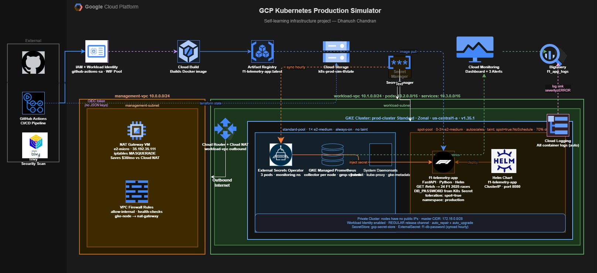
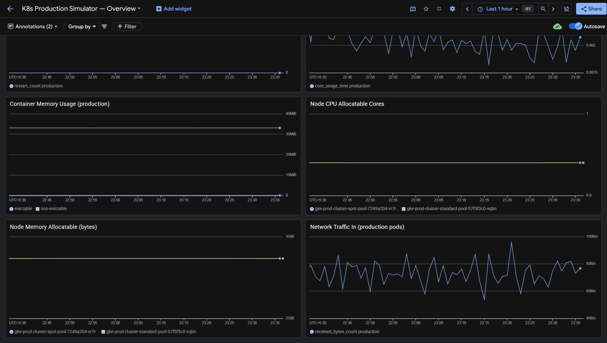
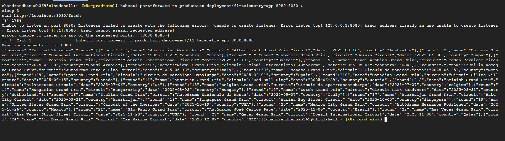

# GCP Kubernetes Production Simulator

A self-learning project where I built a production-style Kubernetes environment on GCP from scratch — no shortcuts, no managed everything. The goal was to actually understand what happens under the hood when companies run Kubernetes in production.

## What I explored

**Infrastructure as Code with Terraform**
Wrote all infrastructure as reusable Terraform modules — VPCs, GKE cluster, IAM, NAT gateway. Nothing was clicked in the console. Everything is version controlled and reproducible with one command.

**GCP Networking**
Built two separate VPCs (management and workload) to understand network segmentation. Instead of using Cloud NAT ($32/month), I set up a custom e2-micro VM as a NAT gateway to understand how NAT actually works at the packet level.

**Kubernetes — GKE Standard**
Chose Standard over Autopilot to get hands-on with node pools, taints, tolerations, and autoscaling. The spot node pool scales from 0 to 3 nodes automatically — application pods run there at 70% cheaper than regular VMs.

**DevSecOps — GitHub Actions + Workload Identity Federation**
No JSON keys anywhere. GitHub Actions authenticates to GCP using Workload Identity Federation — short-lived tokens, zero stored secrets. Every push runs Trivy security scanning before anything deploys. Production deployments require manual approval.

**Secret Management**
Passwords live in GCP Secret Manager. External Secrets Operator syncs them into Kubernetes Secrets automatically every hour. The app never touches Secret Manager directly — ESO handles the bridge.

**Observability**
GKE Managed Prometheus collects metrics automatically. Built a custom Cloud Monitoring dashboard and alerting policies for pod restarts, memory usage, and node availability. ERROR logs route to BigQuery via a log sink for long-term analysis.

**FinOps**
Every decision was made with cost in mind — custom NAT, spot instances, Artifact Registry cleanup policies, nightly teardown via GitHub Actions. The project runs at ~$0.50-1.50/day and costs $0 overnight.

## Stack
Terraform · GKE · GitHub Actions · Helm · Docker · FastAPI · Cloud Build · Artifact Registry · External Secrets Operator · GCP Secret Manager · Cloud Monitoring · BigQuery

## Bring it up from scratch
```bash
bash scripts/bringup.sh
```
Full cluster + app restored in ~12 minutes.

## Tear it down
Trigger the `Teardown Infrastructure` workflow from GitHub Actions.

## Architecture



## Screenshots

### Cloud Monitoring Dashboard


### GitHub Actions Pipeline


### Live F1 Data

